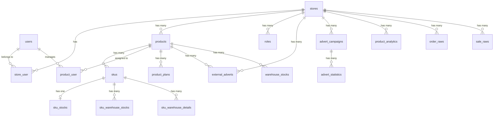

# 📦 WB-App — Полная документация проекта

> **Стек**: Laravel 12 + Filament 3 + PostgreSQL 18 + Redis + Laravel Sail (Docker)
> **Библиотека WB API**: [dakword/wbseller](file:///home/ivan/wb-app/composer.json#L11) v4.31
> **Хостинг/Развертывание**: Docker Compose (Sail)

---

## 📁 Структура проекта

```
wb-app/
├── app/
│   ├── Console/Commands/     # 14 Artisan-команд (синхронизация WB, ABC-анализ)
│   ├── Exports/              # Excel-экспорт (LogisticsExport)
│   ├── Filament/             # Админ-панель Filament
│   │   ├── Pages/            # Кастомные страницы (4 шт.)
│   │   ├── Resources/        # CRUD-ресурсы (7 шт.)
│   │   └── Widgets/          # Виджеты дашборда (8 шт.)
│   ├── Http/Controllers/     # Базовый контроллер (веб-логика через Filament)
│   ├── Imports/              # Excel-импорт (себестоимость, привязка менеджеров)
│   ├── Livewire/             # Livewire-компоненты (аналитика товаров)
│   ├── Models/               # 16 Eloquent-моделей
│   ├── Policies/             # 6 политик доступа (Filament Shield)
│   ├── Providers/            # Service Providers + Filament Panel
│   └── Services/             # WbService — обёртка над WB API
├── config/                   # Конфиги Laravel + filament-shield + permission
├── database/migrations/      # 28 миграций
├── docker/                   # Dockerfile для Sail (PHP 8.4)
├── resources/                # Blade-шаблоны, CSS, JS
├── routes/
│   ├── web.php               # Минимальный (welcome-страница)
│   └── console.php           # Пустой (только inspire)
├── compose.yaml              # Docker Compose (Laravel + PgSQL + Redis)
└── docker-compose.prod.yml   # Продакшен Docker Compose
```

---

## 🗄️ Структура базы данных (PostgreSQL)

### Диаграмма связей (ER)



---

### Таблица `users`
> Пользователи системы (менеджеры, администраторы)

| Колонка | Тип | Описание |
|---------|-----|----------|
| `id` | bigint PK | Внутренний ID |
| `name` | string | Имя пользователя |
| `email` | string, unique | Email |
| `email_verified_at` | datetime, nullable | Дата верификации |
| `password` | string (hashed) | Пароль |
| `remember_token` | string, nullable | Токен «запомнить меня» |
| `created_at` / `updated_at` | timestamps | — |

**Связи**: `stores` (M2M через `store_user`), `products` (M2M через `product_user`), роли через Spatie HasRoles.
**Модель**: [User.php](file:///home/ivan/wb-app/app/Models/User.php)

---

### Таблица `stores`
> Магазины Wildberries (мультитенантность через Filament Tenancy)

| Колонка | Тип | Описание |
|---------|-----|----------|
| `id` | bigint PK | ID магазина |
| `name` | string | Название (напр. «ИП Иванов») |
| `slug` | string, unique | Короткое имя для URL |
| `api_key_standard` | text, nullable | API ключ (Standard) — контент, цены, аналитика |
| `api_key_stat` | text, nullable | API ключ (Статистика) — заказы, продажи |
| `api_key_advert` | text, nullable | API ключ (Реклама) — рекламные кампании |
| `created_at` / `updated_at` | timestamps | — |

**Связи**: `users` (M2M), `products`, `roles`, `externalAdverts` (все HasMany)
**Модель**: [Store.php](file:///home/ivan/wb-app/app/Models/Store.php)

---

### Таблица `store_user` (pivot)
> Связь пользователей с магазинами

| Колонка | Тип | Описание |
|---------|-----|----------|
| `id` | bigint PK | — |
| `user_id` | FK → users | — |
| `store_id` | FK → stores | — |
| `created_at` / `updated_at` | timestamps | — |

---

### Таблица `products`
> Товары, синхронизированные с WB

| Колонка | Тип | Описание |
|---------|-----|----------|
| `id` | bigint PK | Внутренний ID |
| `store_id` | FK → stores | Принадлежность к магазину |
| `nm_id` | bigint, unique | Артикул WB (nmID) |
| `vendor_code` | string, index | Артикул продавца |
| `title` | string, nullable | Название товара |
| `brand` | string, nullable | Бренд |
| `main_image_url` | text, nullable | URL главного фото |
| `cost_price` | decimal(10,2), default 0 | Себестоимость |
| `seasonality` | json, nullable | Сезонность (массив месяцев) |
| `margin_30d` | decimal(8,2), default 0 | Маржа за 30 дней (%) |
| `revenue_30d` | decimal(12,2), default 0 | Выручка за 30 дней (₽) |
| `abc_class` | char(1), nullable | Класс ABC-анализа (A/B/C) |
| `created_at` / `updated_at` | timestamps | — |

**Связи**: `store` (BelongsTo), `skus`, `orders`, `sales`, `plans`, `externalAdverts`, `warehouseStocks` (HasMany), `users` (M2M)
**Модель**: [Product.php](file:///home/ivan/wb-app/app/Models/Product.php)

---

### Таблица `skus`
> Размеры (SKU) товара — каждый баркод = отдельный размер

| Колонка | Тип | Описание |
|---------|-----|----------|
| `id` | bigint PK | — |
| `product_id` | FK → products | Привязка к товару |
| `barcode` | string, unique | Штрихкод WB |
| `tech_size` | string, nullable | Размер (S, M, 42, 44...) |
| `price` | decimal, nullable | Цена (добавлена миграцией) |
| `discount` | int, nullable | Скидка (%) |
| `created_at` / `updated_at` | timestamps | — |

**Связи**: `product` (BelongsTo), `stock` (HasOne → sku_stocks), `warehouseStocks` (HasMany), `sales`, `orders` (HasMany по barcode)
**Модель**: [Sku.php](file:///home/ivan/wb-app/app/Models/Sku.php)

---

### Таблица `order_raws`
> Сырые данные заказов с WB (API Statistics ordersFromDate)

| Колонка | Тип | Описание |
|---------|-----|----------|
| `id` | bigint PK | — |
| `store_id` | FK → stores | Магазин |
| `srid` | string, unique | Уникальный ID заказа WB |
| `order_date` | datetime | Дата заказа |
| `last_change_date` | datetime, nullable | Дата последнего изменения |
| `nm_id` | bigint, index | Артикул WB |
| `barcode` | string, index | Штрихкод |
| `total_price` | decimal(10,2) | Цена до скидки |
| `discount_percent` | int | Скидка (%) |
| `warehouse_name` | string, nullable | Склад отгрузки |
| `oblast_okrug_name` | string, nullable | Регион доставки |
| `finished_price` | decimal(10,2) | Фактическая цена |
| `is_cancel` | boolean | Отмена (да/нет) |
| `cancel_dt` | datetime, nullable | Дата отмены |
| `created_at` / `updated_at` | timestamps | — |

**Модель**: [OrderRaw.php](file:///home/ivan/wb-app/app/Models/OrderRaw.php)

---

### Таблица `sale_raws`
> Сырые данные продаж/выкупов с WB (API Statistics salesFromDate)

| Колонка | Тип | Описание |
|---------|-----|----------|
| `id` | bigint PK | — |
| `store_id` | FK → stores | Магазин |
| `sale_id` | string, unique | Уникальный ID продажи (S123...) |
| `sale_date` | datetime | Дата продажи |
| `last_change_date` | datetime, nullable | Дата последнего изменения |
| `nm_id` | bigint, index | Артикул WB |
| `barcode` | string, index | Штрихкод |
| `total_price` | decimal(10,2) | Цена до скидки |
| `discount_percent` | int | Скидка (%) |
| `price_with_disc` | decimal(10,2) | Цена со скидкой |
| `for_pay` | decimal(10,2) | К перечислению продавцу |
| `finished_price` | decimal(10,2) | Фактическая цена |
| `warehouse_name` | string, nullable | Склад |
| `region_name` | string, nullable | Регион |
| `created_at` / `updated_at` | timestamps | — |

**Модель**: [SaleRaw.php](file:///home/ivan/wb-app/app/Models/SaleRaw.php)

---

### Таблица `product_analytics`
> Воронка продаж по дням (API v3 History)

| Колонка | Тип | Описание |
|---------|-----|----------|
| `id` | bigint PK | — |
| `store_id` | FK → stores | Магазин |
| `nm_id` | bigint, index | Артикул WB |
| `date` | date, index | Дата |
| `vendor_code` | string, nullable | Артикул продавца |
| `brand_name` | string, nullable | Бренд |
| `object_id` | bigint, nullable | ID категории |
| `object_name` | string, nullable | Название категории |
| `open_card_count` | int | Открытия карточки |
| `add_to_cart_count` | int | В корзину |
| `orders_count` | int | Заказы |
| `buyouts_count` | int | Выкупы |
| `cancel_count` | int | Отмены |
| `orders_sum_rub` | decimal(15,2) | Сумма заказов (₽) |
| `buyouts_sum_rub` | decimal(15,2) | Сумма выкупов (₽) |
| `cancel_sum_rub` | decimal(15,2) | Сумма отмен (₽) |
| `avg_price_rub` | decimal(15,2) | Средняя цена (₽) |
| `avg_orders_count_per_day` | decimal(10,2) | Средние заказы в день |
| `conversion_open_to_cart_percent` | int | Конверсия: открытие → корзина (%) |
| `conversion_cart_to_order_percent` | int | Конверсия: корзина → заказ (%) |
| `conversion_buyouts_percent` | int | Конверсия: выкуп (%) |
| `stocks_mp` | int | Остатки на складе продавца |
| `stocks_wb` | int | Остатки на складе WB |

**Уникальный индекс**: `(store_id, nm_id, date)`
**Модель**: [ProductAnalytic.php](file:///home/ivan/wb-app/app/Models/ProductAnalytic.php)

---

### Таблица `advert_campaigns`
> Рекламные кампании WB

| Колонка | Тип | Описание |
|---------|-----|----------|
| `id` | bigint PK | Внутренний ID |
| `store_id` | FK → stores | Магазин |
| `advert_id` | bigint, unique | ID кампании в WB |
| `name` | string, nullable | Название |
| `type` | int | Тип: 4-Каталог, 5-Карточка, 6-Поиск, 8-Авто, 9-Поиск+Каталог |
| `status` | int | Статус: 9-Активна, 11-Пауза, 7-Архив, 4-Готова, -1-Удалена |
| `daily_budget` | decimal(10,2) | Дневной бюджет (₽) |
| `create_time` | datetime, nullable | Дата создания |
| `change_time` | datetime, nullable | Дата изменения |
| `start_time` | datetime, nullable | Дата запуска |
| `end_time` | datetime, nullable | Дата окончания |
| `nm_id` | bigint, nullable | Привязанный артикул WB |
| `subject_id` | bigint, nullable | ID предмета |
| `raw_data` | json, nullable | Полный JSON ответа WB |

**Связи**: `store` (BelongsTo), `product` (BelongsTo по nm_id), `statistics` (HasMany)
**Модель**: [AdvertCampaign.php](file:///home/ivan/wb-app/app/Models/AdvertCampaign.php)

---

### Таблица `advert_statistics`
> Статистика рекламных кампаний по дням (API v3 fullstats)

| Колонка | Тип | Описание |
|---------|-----|----------|
| `id` | bigint PK | — |
| `advert_campaign_id` | FK → advert_campaigns | Кампания |
| `date` | date, index | Дата |
| `views` | int | Просмотры |
| `clicks` | int | Клики |
| `ctr` | float | CTR (%) |
| `cpc` | float | Цена клика (₽) |
| `spend` | decimal(10,2) | Затраты (₽) |
| `atbs` | int | Добавления в корзину |
| `orders` | int | Заказы |
| `cr` | float | Конверсия (CR) |
| `shks` | int | Штуки (выкупы) |
| `sum_price` | decimal(12,2) | Сумма заказов (₽) |

**Уникальный индекс**: `(advert_campaign_id, date)`
**Модель**: [AdvertStatistic.php](file:///home/ivan/wb-app/app/Models/AdvertStatistic.php)

---

### Таблица `external_adverts`
> Внешняя реклама (блогеры, закупы)

| Колонка | Тип | Описание |
|---------|-----|----------|
| `id` | bigint PK | — |
| `store_id` | FK → stores | Магазин |
| `product_id` | FK → products | Товар |
| `blogger_link` | string | Ссылка на блогера |
| `ad_cost` | decimal(10,2) | Стоимость рекламы |
| `ad_spent` | decimal(10,2) | Потрачено фактически |
| `platform` | string | Платформа (Instagram, YouTube, ...) |
| `formats` | json | Форматы рекламы |
| `release_date` | date | Дата публикации |
| `status` | string, default 'not_published' | Статус |

**Модель**: [ExternalAdvert.php](file:///home/ivan/wb-app/app/Models/ExternalAdvert.php)

---

### Таблица `product_plans`
> Планы по заказам/выкупам на месяц

| Колонка | Тип | Описание |
|---------|-----|----------|
| `id` | bigint PK | — |
| `product_id` | FK → products | Товар |
| `year` | smallint | Год |
| `month` | tinyint | Месяц (1-12) |
| `orders_plan` | int, default 0 | План заказов (шт.) |
| `sales_plan` | int, default 0 | План выкупов (шт.) |

**Уникальный индекс**: `(product_id, year, month)`
**Модель**: [ProductPlan.php](file:///home/ivan/wb-app/app/Models/ProductPlan.php)

---

### Таблица `product_user` (pivot)
> Привязка менеджера к товарам

| Колонка | Тип | Описание |
|---------|-----|----------|
| `id` | bigint PK | — |
| `user_id` | FK → users | Менеджер |
| `product_id` | FK → products | Товар |

**Уникальный индекс**: `(user_id, product_id)`

---

### Таблица `sku_stocks`
> Внутренние остатки (наш склад, фабрика, в пути)

| Колонка | Тип | Описание |
|---------|-----|----------|
| `id` | bigint PK | — |
| `sku_id` | FK → skus, unique | Размер (1 запись на SKU) |
| `stock_own` | int | Наш склад |
| `in_transit_to_wb` | int | В пути на WB |
| `in_transit_general` | int | Карго / в пути общее |
| `at_factory` | int | На фабрике |

**Модель**: [SkuStock.php](file:///home/ivan/wb-app/app/Models/SkuStock.php)

---

### Таблица `sku_warehouse_stocks`
> Агрегированные остатки на складах WB (по SKU)

| Колонка | Тип | Описание |
|---------|-----|----------|
| `id` | bigint PK | — |
| `sku_id` | FK → skus | Размер |
| `warehouse_name` | string, nullable | Склад (null = агрегированно) |
| `quantity` | int | Количество |
| `in_way_to_client` | int | В пути к клиенту |
| `in_way_from_client` | int | В пути от клиента |

**Модель**: [SkuWarehouseStock.php](file:///home/ivan/wb-app/app/Models/SkuWarehouseStock.php)

---

### Таблица `sku_warehouse_details`
> Детализация остатков по физическим складам WB

| Колонка | Тип | Описание |
|---------|-----|----------|
| `id` | bigint PK | — |
| `sku_id` | FK → skus | Размер |
| `warehouse_name` | string | Физический склад (Коледино, Тула...) |
| `quantity` | int | Количество |

**Уникальный индекс**: `(sku_id, warehouse_name)`
**Модель**: [SkuWarehouseDetail.php](file:///home/ivan/wb-app/app/Models/SkuWarehouseDetail.php)

---

### Таблица `warehouse_stocks`
> Остатки FBO по складам (через WB Analytics API)

| Колонка | Тип | Описание |
|---------|-----|----------|
| `id` | bigint PK | — |
| `product_id` | FK → products | Товар |
| `nm_id` | bigint | Артикул WB |
| `chrt_id` | bigint | ID размера WB |
| `warehouse_id` | bigint | ID склада WB |
| `warehouse_name` | string | Название склада |
| `region_name` | string, nullable | Регион |
| `quantity` | int | Количество |
| `in_way_to_client` | int | В пути к клиенту |
| `in_way_from_client` | int | В пути от клиента |

**Уникальный индекс**: `(nm_id, chrt_id, warehouse_id)`
**Модель**: [WarehouseStock.php](file:///home/ivan/wb-app/app/Models/WarehouseStock.php)

---

### Таблица `roles` (Spatie Permission + store_id)
> Роли с привязкой к магазину

| Колонка | Тип | Описание |
|---------|-----|----------|
| `id` | bigint PK | — |
| `name` | string | Название роли |
| `guard_name` | string | Guard |
| `store_id` | FK → stores, nullable | Привязка к магазину |

**Модель**: [Role.php](file:///home/ivan/wb-app/app/Models/Role.php) (extends Spatie Role)

---

### Системные таблицы

| Таблица | Назначение |
|---------|------------|
| `permissions` | Permissions (Spatie) |
| `model_has_permissions` | Связь модель ↔ permission |
| `model_has_roles` | Связь модель ↔ role |
| `role_has_permissions` | Связь role ↔ permission |
| `cache` / `cache_locks` | Кэш Laravel |
| `sessions` | Сессии |
| `jobs` / `job_batches` / `failed_jobs` | Очереди |

---

## 🌐 API Wildberries — Используемые эндпоинты

### Через библиотеку `dakword/wbseller`

| Сервис | Метод | Описание | Ключ API |
|--------|-------|----------|----------|
| Content | `getCardsList()` | Получение списка карточек товаров | `api_key_standard` |
| Prices | `getPrices()` | Получение цен и скидок | `api_key_standard` |
| Statistics | `ordersFromDate()` | Получение заказов с даты | `api_key_stat` |
| Statistics | `salesFromDate()` | Получение продаж с даты | `api_key_stat` |

### Прямые HTTP-запросы (Laravel Http)

| Эндпоинт | Метод | Описание | Ключ API |
|----------|-------|----------|----------|
| `seller-analytics-api.wb.ru/api/analytics/v3/sales-funnel/products/history` | POST | Воронка продаж по дням (макс. 20 nmId, 7 дней) | `api_key_standard` |
| `seller-analytics-api.wb.ru/api/analytics/v3/sales-funnel/products` | POST | Тест воронки продаж | `api_key_standard` |
| `seller-analytics-api.wb.ru/api/analytics/v1/stocks-report/wb-warehouses` | POST | Остатки FBO по складам (макс. 1000 nmId) | `api_key_standard` |
| `advert-api.wb.ru/adv/v1/promotion/count` | GET | Список рекламных кампаний | `api_key_advert` |
| `advert-api.wb.ru/api/advert/v2/adverts` | GET | Детали кампаний (макс. 50 ID) | `api_key_advert` |
| `advert-api.wb.ru/adv/v3/fullstats` | GET | Статистика рекламы по дням | `api_key_advert` |
| `seller-analytics-api.wb.ru/api/v1/warehouse_remains` | GET | Запрос генерации отчёта по остаткам | `api_key_standard` |
| `seller-analytics-api.wb.ru/api/v1/warehouse_remains/tasks/{id}/status` | GET | Статус задачи отчёта | `api_key_standard` |
| `seller-analytics-api.wb.ru/api/v1/warehouse_remains/tasks/{id}/download` | GET | Скачивание отчёта | `api_key_standard` |

### Лимиты API WB

| API | Лимит | Реализация |
|-----|-------|------------|
| Аналитика (воронка) | 3 запроса/мин (1 запрос в 20 сек) | `waitTimer(21)` |
| Реклама (кампании) | 5 запросов/сек | `usleep(250000)` |
| Реклама (статистика v3) | 3 запроса/мин | `sleep(61)` |
| Остатки FBO | ~2 запроса/мин | `waitTimer(31)` |
| Отчёт по остаткам | 1 запрос/мин | Ручной запуск |

---

## 🛠️ Сервисы

### [WbService](file:///home/ivan/wb-app/app/Services/WbService.php)

Обёртка над библиотекой `dakword/wbseller`. Инициализируется экземпляром `Store` и настраивает API-ключи:

```php
$wb = new WbService($store);
$wb->api->Content()       // API Контента
$wb->api->Prices()        // API Цен
$wb->api->Statistics()    // API Статистики
```

**Маппинг ключей:**
- `content`, `prices`, `marketplace`, `analytics` → `api_key_standard`
- `statistics` → `api_key_stat`
- `adv` → `api_key_advert`

---

## ⚙️ Artisan-команды

### Синхронизация товаров

| Команда | Описание | API |
|---------|----------|-----|
| `wb:sync-products` | Полная синхронизация товаров и SKU (пагинация через курсор) | Content `getCardsList()` |
| `wb:sync-data` | Обновление цен и скидок по баркодам | Prices `getPrices()` |

### Синхронизация заказов и продаж

| Команда | Опции | Описание | API |
|---------|-------|----------|-----|
| `wb:sync-orders` | `--days=N`, `--store=ID` | Инкрементальная синхронизация заказов (upsert по `srid`) | Statistics `ordersFromDate()` |
| `wb:sync-sales` | `--days=N`, `--store=ID` | Инкрементальная синхронизация продаж (upsert по `sale_id`) | Statistics `salesFromDate()` |

### Синхронизация аналитики

| Команда | Опции | Описание | API |
|---------|-------|----------|-----|
| `wb:sync-analytics` | `--days=7` | Воронка продаж по дням (upsert по `store_id+nm_id+date`) | Analytics v3 History |
| `wb:sync-stocks` | — | Остатки FBO по складам (upsert по `nm_id+chrt_id+warehouse_id`) | Analytics v1 stocks-report |

### Синхронизация рекламы

| Команда | Опции | Описание | API |
|---------|-------|----------|-----|
| `wb:sync-adverts` | — | Загрузка рекламных кампаний (список + детали) | Advert v1 + v2 |
| `wb:sync-advert-stats` | `--days=3` | Статистика по активным кампаниям (upsert по `campaign_id+date`) | Advert v3 fullstats |

### Остатки на складах (3-шаговый процесс)

| Шаг | Команда | Описание |
|-----|---------|----------|
| 1️⃣ | `wb:request-remains {store_id}` | Отправляет запрос на генерацию отчёта, получает `task_id` |
| 2️⃣ | `wb:download-remains {store_id} {task_id}` | Скачивает готовый отчёт в `storage/app/wb_reports/` |
| 3️⃣a | `wb:parse-remains {store_id} {task_id}` | Парсит агрегированные остатки (→ `sku_warehouse_stocks`) |
| 3️⃣b | `wb:parse-remains-details {store_id} {task_id}` | Парсит разбивку по физическим складам (→ `sku_warehouse_details`) |

### Аналитика и расчёты

| Команда | Описание |
|---------|----------|
| `products:calculate-abc` | ABC-анализ товаров за 30 дней (выручка из `sale_raws`, классификация 80/15/5%) |

### Тестирование

| Команда | Описание |
|---------|----------|
| `wb:test-api` | Тестовый запрос к API v3 воронки продаж (5 товаров) |

---

## 🖥️ Filament — Админ-панель

### Конфигурация
- **Путь**: `/admin`
- **Тенант**: `Store` (мультимагазинность)
- **Регистрация тенанта**: [RegisterStore](file:///home/ivan/wb-app/app/Filament/Pages/RegisterStore.php)
- **Цветовая схема**: Amber
- **Плагины**: Filament Shield (управление правами)
- **Модель**: [AdminPanelProvider.php](file:///home/ivan/wb-app/app/Providers/Filament/AdminPanelProvider.php)

### Ресурсы (CRUD)

| Ресурс | Модель | Описание |
|--------|--------|----------|
| [ProductResource](file:///home/ivan/wb-app/app/Filament/Resources/ProductResource.php) | Product | Управление товарами |
| [StoreResource](file:///home/ivan/wb-app/app/Filament/Resources/StoreResource.php) | Store | Управление магазинами |
| [UserResource](file:///home/ivan/wb-app/app/Filament/Resources/UserResource.php) | User | Управление пользователями |
| [AdvertCampaignResource](file:///home/ivan/wb-app/app/Filament/Resources/AdvertCampaignResource.php) | AdvertCampaign | Рекламные кампании |
| [ExternalAdvertResource](file:///home/ivan/wb-app/app/Filament/Resources/ExternalAdvertResource.php) | ExternalAdvert | Внешняя реклама |
| [LogisticsResource](file:///home/ivan/wb-app/app/Filament/Resources/LogisticsResource.php) | Product (view) | Логистика и остатки |
| [WarehouseStockResource](file:///home/ivan/wb-app/app/Filament/Resources/WarehouseStockResource.php) | WarehouseStock | Остатки FBO |

### Страницы

| Страница | Описание |
|----------|----------|
| [RegisterStore](file:///home/ivan/wb-app/app/Filament/Pages/RegisterStore.php) | Регистрация нового магазина |
| [ImportCostPrice](file:///home/ivan/wb-app/app/Filament/Pages/ImportCostPrice.php) | Импорт себестоимости из Excel |
| [ImportManagerProducts](file:///home/ivan/wb-app/app/Filament/Pages/ImportManagerProducts.php) | Привязка товаров к менеджеру через Excel |
| [MyProducts](file:///home/ivan/wb-app/app/Filament/Pages/MyProducts.php) | «Мои товары» — персональная страница менеджера |

### Виджеты (Dashboard)

| Виджет | Описание |
|--------|----------|
| [DashboardStatsOverview](file:///home/ivan/wb-app/app/Filament/Widgets/DashboardStatsOverview.php) | Общая статистика (заказы, продажи, выручка) |
| [DashboardSalesChart](file:///home/ivan/wb-app/app/Filament/Widgets/DashboardSalesChart.php) | График продаж |
| [TopProductsTable](file:///home/ivan/wb-app/app/Filament/Widgets/TopProductsTable.php) | Топ товаров |
| [MyPersonalStatsWidget](file:///home/ivan/wb-app/app/Filament/Widgets/MyPersonalStatsWidget.php) | Персональная статистика менеджера |
| [MyProductStocksTable](file:///home/ivan/wb-app/app/Filament/Widgets/MyProductStocksTable.php) | Остатки «моих» товаров |
| [MyStatsWidget](file:///home/ivan/wb-app/app/Filament/Widgets/MyStatsWidget.php) | Мини-статистика менеджера |
| [UserAssignedProductsWidget](file:///home/ivan/wb-app/app/Filament/Widgets/UserAssignedProductsWidget.php) | Товары, привязанные к текущему пользователю |

### Livewire-компоненты

| Компонент | Описание |
|-----------|----------|
| [ProductAnalyticsTable](file:///home/ivan/wb-app/app/Livewire/ProductAnalyticsTable.php) | Таблица аналитики товаров |

---

## 📊 Excel — Импорт/Экспорт

### Экспорт

| Класс | Описание |
|-------|----------|
| [LogisticsExport](file:///home/ivan/wb-app/app/Exports/LogisticsExport.php) | Выгрузка логистики: баркод, размер, остатки (фабрика, свой склад, WB), заказы/выкупы за 14 и 30 дней, воронка, конверсии |

### Импорт

| Класс | Описание |
|-------|----------|
| [ProductsCostPriceImport](file:///home/ivan/wb-app/app/Imports/ProductsCostPriceImport.php) | Импорт себестоимости из Excel (столбец A = nm_id, столбец B = цена) |
| [ProductsAssignManagerImport](file:///home/ivan/wb-app/app/Imports/ProductsAssignManagerImport.php) | Привязка товаров к менеджеру (столбец B = nm_id) |

---

## 🔐 Безопасность и доступ

### Spatie Permission + Filament Shield

- **Роли**: Привязаны к магазинам (`store_id` в таблице `roles`)
- **Политики**: 6 политик ([AdvertCampaignPolicy](file:///home/ivan/wb-app/app/Policies/AdvertCampaignPolicy.php), [ExternalAdvertPolicy](file:///home/ivan/wb-app/app/Policies/ExternalAdvertPolicy.php), [ProductPolicy](file:///home/ivan/wb-app/app/Policies/ProductPolicy.php), [RolePolicy](file:///home/ivan/wb-app/app/Policies/RolePolicy.php), [StorePolicy](file:///home/ivan/wb-app/app/Policies/StorePolicy.php), [UserPolicy](file:///home/ivan/wb-app/app/Policies/UserPolicy.php))
- **Мультитенантность**: Через `Filament Tenancy` — каждый пользователь видит только свои магазины

---

## 🐳 Docker — Инфраструктура

### Сервисы ([compose.yaml](file:///home/ivan/wb-app/compose.yaml))

| Сервис | Образ | Порт | Назначение |
|--------|-------|------|------------|
| `laravel.test` | `sail-8.4/app` (PHP 8.4) | 80, 5173 | Laravel + Vite |
| `pgsql` | `postgres:18-alpine` | 5432 | PostgreSQL |
| `redis` | `redis:alpine` | 6379 | Redis (кэш, очереди) |

### Основные зависимости ([composer.json](file:///home/ivan/wb-app/composer.json))

| Пакет | Версия | Назначение |
|-------|--------|------------|
| `filament/filament` | ^3.2 | Админ-панель |
| `dakword/wbseller` | ^4.31 | Библиотека WB Seller API |
| `bezhansalleh/filament-shield` | ^3.9 | Управление правами в Filament |
| `maatwebsite/excel` | ^3.1 | Импорт/экспорт Excel |
| `flowframe/laravel-trend` | ^0.4.0 | Трендовые графики |
| `laravel/sail` | ^1.41 | Docker-окружение (dev) |

---

## 🔄 Паттерны работы с данными

### Upsert-стратегия
Все команды синхронизации используют `Model::upsert()` с чанками по 500-1000 записей для обхода лимитов PostgreSQL по количеству параметров.

### Инкрементальная загрузка
- **Заказы/Продажи**: Определяется `last_change_date` последней записи, загрузка начинается с `last_change_date - 30 минут`
- **Аналитика**: Загружается за последние N дней (по умолчанию 7)
- **Реклама**: Полная перезагрузка всех кампаний + статистика только по активным (status=9)

### ABC-анализ
Классификация товаров по выручке за 30 дней: **A** (80% выручки), **B** (15%), **C** (5%).
