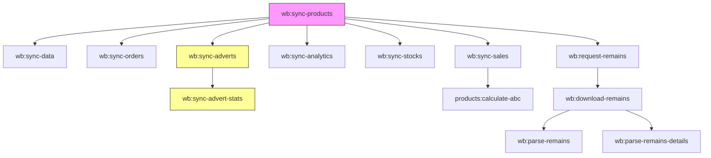

# 🔌 Интеграции Wildberries API — Полное руководство для миграции

> **Цель документа**: Описать каждую интеграцию с WB настолько подробно, чтобы можно было воспроизвести на любом стеке, не заглядывая в старый код.
>
> **Критически важно**: БД остаётся прежней. Все upsert-ключи, имена таблиц и колонок — неизменны.

---

## 📋 Оглавление

1. [Общая архитектура и API-ключи](#1-общая-архитектура-и-api-ключи)
2. [Интеграция 1: Синхронизация товаров (wb:sync-products)](#2-интеграция-1-синхронизация-товаров)
3. [Интеграция 2: Синхронизация цен (wb:sync-data)](#3-интеграция-2-синхронизация-цен)
4. [Интеграция 3: Синхронизация заказов (wb:sync-orders)](#4-интеграция-3-синхронизация-заказов)
5. [Интеграция 4: Синхронизация продаж (wb:sync-sales)](#5-интеграция-4-синхронизация-продаж)
6. [Интеграция 5: Воронка продаж / Аналитика (wb:sync-analytics)](#6-интеграция-5-воронка-продаж)
7. [Интеграция 6: Остатки FBO по складам (wb:sync-stocks)](#7-интеграция-6-остатки-fbo)
8. [Интеграция 7: Рекламные кампании (wb:sync-adverts)](#8-интеграция-7-рекламные-кампании)
9. [Интеграция 8: Статистика рекламы (wb:sync-advert-stats)](#9-интеграция-8-статистика-рекламы)
10. [Интеграция 9-11: Отчёт по остаткам (3-шаговый процесс)](#10-интеграция-9-11-отчёт-по-остаткам)
11. [Интеграция 12: ABC-анализ (products:calculate-abc)](#11-интеграция-12-abc-анализ)
12. [Порядок запуска и зависимости](#12-порядок-запуска-и-зависимости)
13. [Сводная таблица rate-limits](#13-сводная-таблица-rate-limits)

---

## 1. Общая архитектура и API-ключи

### Хранение ключей

Все API-ключи хранятся в таблице `stores`. У каждого магазина — **три отдельных ключа**:

| Поле в БД | Какие API использует | Какие команды |
|-----------|---------------------|---------------|
| `api_key_standard` | Content, Prices, Analytics, Stocks | `wb:sync-products`, `wb:sync-data`, `wb:sync-analytics`, `wb:sync-stocks`, `wb:request-remains`, `wb:download-remains` |
| `api_key_stat` | Statistics (заказы, продажи) | `wb:sync-orders`, `wb:sync-sales` |
| `api_key_advert` | Advert (реклама) | `wb:sync-adverts`, `wb:sync-advert-stats` |

### Два способа вызова API

1. **Через библиотеку `dakword/wbseller` v4.31** — используется для Content, Prices, Statistics
2. **Прямые HTTP-запросы (Laravel Http / cURL)** — используется для Analytics, Stocks, Advert

### Инициализация библиотеки dakword/wbseller

```php
$api = new \Dakword\WBSeller\API([
    'keys' => [
        'content'     => $store->api_key_standard,
        'prices'      => $store->api_key_standard,
        'marketplace' => $store->api_key_standard,
        'statistics'  => $store->api_key_stat,
        'adv'         => $store->api_key_advert,
        'analytics'   => $store->api_key_standard,
    ],
]);
```

### Общий паттерн всех команд

```
1. Загружаем ВСЕ магазины из таблицы `stores`
2. Для каждого магазина:
   a. Проверяем наличие нужного API-ключа
   b. Вызываем WB API
   c. Трансформируем данные
   d. Сохраняем через upsert чанками по 500-1000
```

---

## 2. Интеграция 1: Синхронизация товаров

> **Команда**: `wb:sync-products`
> **Таблицы**: `products`, `skus`
> **API-ключ**: `api_key_standard`
> **Метод доступа**: Библиотека dakword — `$api->Content()->getCardsList()`

### Алгоритм (пошагово)

```
1. Загрузить все магазины из `stores`
2. Для каждого магазина:
   a. Инициализировать WbService
   b. Начальные значения курсора: updatedAt = '', nmId = 0
   c. ЦИКЛ ПАГИНАЦИИ:
      i.   Вызвать getCardsList(limit: 100, updatedAt, nmId)
      ii.  Если cards пуст — СТОП
      iii. Обработать пачку (processCards)
      iv.  Прочитать cursor из ответа:
           - Если cursor.updatedAt == старый И cursor.nmID == старый → зациклился, СТОП
           - Иначе: updatedAt = cursor.updatedAt, nmId = cursor.nmID
      v.   Если получено < 100 карточек → СТОП (последняя страница)
      vi.  Перейти к шагу (i)
```

### API: Content → getCardsList

Этот метод из библиотеки dakword скрывает прямой HTTP-запрос. Эквивалент:

```
POST https://content-api.wildberries.ru/content/v2/get/cards/list
Headers:
  Authorization: {api_key_standard}
  Content-Type: application/json
Body:
{
  "settings": {
    "cursor": { "limit": 100, "updatedAt": "", "nmID": 0 },
    "filter": { "withPhoto": -1 }
  }
}
```

### Формат ответа WB

```json
{
  "cards": [
    {
      "nmID": 123456789,
      "vendorCode": "ART-001",
      "title": "Футболка мужская",
      "brand": "MyBrand",
      "photos": [
        { "big": "https://basket-01.wb.ru/vol123/part456/123456789/images/big/1.webp" }
      ],
      "sizes": [
        {
          "techSize": "44",
          "wbSize": "S",
          "skus": ["2000000000001", "2000000000002"]
        }
      ]
    }
  ],
  "cursor": {
    "updatedAt": "2025-12-01T12:00:00Z",
    "nmID": 123456790,
    "total": 500
  }
}
```

### Маппинг WB → БД (таблица `products`)

| WB API поле | Колонка в БД | Тип | Примечание |
|-------------|-------------|-----|------------|
| `card.nmID` | `nm_id` | bigint, UNIQUE | Основной идентификатор товара |
| _(из контекста)_ | `store_id` | FK → stores | ID текущего магазина |
| `card.vendorCode` | `vendor_code` | string | Дефолт: 'Без артикула' |
| `card.title` | `title` | string, nullable | Дефолт: 'Без названия' |
| `card.brand` | `brand` | string, nullable | — |
| `card.photos[0].big` | `main_image_url` | text, nullable | Берётся ТОЛЬКО первое фото |

### Upsert в `products`

```
Conflict key:   ['nm_id']
Update fields:  ['store_id', 'vendor_code', 'title', 'brand', 'main_image_url', 'updated_at']
Chunk size:     Без ограничения (обычно < 100 за раз)
```

> [!IMPORTANT]
> Поле `cost_price` НЕ затирается при upsert — оно заполняется только вручную через импорт Excel.

### Маппинг WB → БД (таблица `skus`)

| WB API поле | Колонка в БД | Тип | Примечание |
|-------------|-------------|-----|------------|
| `size.skus[i]` | `barcode` | string, UNIQUE | Каждый элемент массива `skus` — это отдельный баркод |
| _(из lookup)_ | `product_id` | FK → products | Определяется по nm_id через `Product::whereIn('nm_id', $nmIds)->pluck('id', 'nm_id')` |
| `size.techSize` ∥ `size.wbSize` | `tech_size` | string, nullable | Приоритет: techSize, потом wbSize, потом '-' |

### Upsert в `skus`

```
Conflict key:   ['barcode']
Update fields:  ['product_id', 'tech_size', 'updated_at']
Chunk size:     1000
```

> [!WARNING]
> Структура вложенности: `card → sizes[] → skus[]`. Один `size` может содержать несколько баркодов. Каждый баркод — это отдельная строка в `skus`.

---

## 3. Интеграция 2: Синхронизация цен

> **Команда**: `wb:sync-data`
> **Таблица**: `skus` (обновление полей `price` и `discount`)
> **API-ключ**: `api_key_standard`
> **Метод доступа**: Библиотека dakword — `$api->Prices()->getPrices()`

### Алгоритм

```
1. Загрузить все магазины
2. Для каждого:
   a. Вызвать Prices()->getPrices()
   b. Получить data.listGoods[]
   c. Для каждого good:
      - Для каждого size в good.sizes[]:
        - Найти Product по nm_id = good.nmID
        - Обновить SKU с matching tech_size:
          SET price = size.price, discount = good.discount
```

### Формат ответа WB

```json
{
  "data": {
    "listGoods": [
      {
        "nmID": 123456789,
        "discount": 25,
        "sizes": [
          {
            "techSizeName": "44",
            "price": 3500
          }
        ]
      }
    ]
  }
}
```

### Маппинг WB → БД (UPDATE `skus`)

| WB API поле | Колонка в БД | Примечание |
|-------------|-------------|------------|
| `size.price` | `price` | Цена до скидки (руб) |
| `good.discount` | `discount` | Скидка (%), одна на весь товар |

### Метод обновления

**НЕ upsert**, а прямой `UPDATE`:
```sql
UPDATE skus SET price = ?, discount = ?
WHERE product_id = (SELECT id FROM products WHERE nm_id = ?)
  AND tech_size = ?
```

> [!WARNING]
> В API цен WB **нет баркода**! Поиск SKU идёт через цепочку: `nm_id → Product → skus WHERE tech_size = ?`. Если `techSizeName` = null, обновление пропускается.

---

## 4. Интеграция 3: Синхронизация заказов

> **Команда**: `wb:sync-orders --days=N --store=ID`
> **Таблица**: `order_raws`
> **API-ключ**: `api_key_stat`
> **Метод доступа**: Библиотека dakword — `$api->Statistics()->ordersFromDate($dateFrom)`
> **Таймзона**: `Europe/Moscow`

### Алгоритм определения стартовой даты

```
ЕСЛИ передан --days=N:
    startDate = now() - N дней
ИНАЧЕ ЕСЛИ в order_raws есть записи для этого store_id:
    startDate = MAX(last_change_date) - 30 минут  ← страховка от потери данных
ИНАЧЕ:
    startDate = now() - 30 дней  ← первый запуск
```

### Алгоритм инкрементальной загрузки

```
1. currentDateFrom = startDate
2. ЦИКЛ:
   a. Запрос: ordersFromDate(currentDateFrom)
   b. Если ответ пуст → СТОП
   c. Собрать массив upsertData[] + вычислить maxLastChangeDate
   d. Upsert пачками по 1000
   e. Определить следующую дату:
      - Если maxLastChangeDate <= currentDateFrom → currentDateFrom + 1 секунда
      - Иначе → maxLastChangeDate
   f. Если count > 2000 → sleep(2) (защита от спама)
   g. Перейти к (a)
```

### API: Statistics → ordersFromDate

Эквивалент прямого запроса (скрыт в библиотеке):

```
GET https://statistics-api.wildberries.ru/api/v1/supplier/orders
Headers:
  Authorization: {api_key_stat}
Query:
  dateFrom: 2025-12-01T00:00:00
```

### Формат ответа WB (массив объектов)

```json
[
  {
    "srid": "abc123def456...",
    "date": "2025-12-01T10:30:00",
    "lastChangeDate": "2025-12-01T12:00:00",
    "nmId": 123456789,
    "barcode": "2000000000001",
    "totalPrice": 3500.00,
    "discountPercent": 25,
    "warehouseName": "Коледино",
    "oblastOkrugName": "Центральный федеральный округ",
    "finishedPrice": 2625.00,
    "isCancel": false,
    "cancelDate": null
  }
]
```

### Полный маппинг WB → БД (`order_raws`)

| WB API поле | Колонка в БД | Тип | Дефолт |
|-------------|-------------|-----|--------|
| `item.srid` | `srid` | string, **UNIQUE** | — |
| _(контекст)_ | `store_id` | FK → stores | — |
| `item.date` | `order_date` | datetime | — |
| `item.lastChangeDate` | `last_change_date` | datetime, nullable | — |
| `item.nmId` | `nm_id` | bigint, INDEX | — |
| `item.barcode` | `barcode` | string, INDEX | — |
| `item.totalPrice` | `total_price` | decimal(10,2) | 0 |
| `item.discountPercent` | `discount_percent` | int | 0 |
| `item.warehouseName` | `warehouse_name` | string, nullable | — |
| `item.oblastOkrugName` | `oblast_okrug_name` | string, nullable | — |
| `item.finishedPrice` | `finished_price` | decimal(10,2) | 0 |
| `item.isCancel` | `is_cancel` | boolean | false |
| `item.cancelDate` | `cancel_dt` | datetime, nullable | — |

### Upsert в `order_raws`

```
Conflict key:   ['srid']
Update fields:  ['last_change_date', 'total_price', 'discount_percent',
                 'finished_price', 'is_cancel', 'cancel_dt', 'updated_at',
                 'warehouse_name', 'oblast_okrug_name']
Chunk size:     1000
```

> [!IMPORTANT]
> Поля `store_id`, `order_date`, `nm_id`, `barcode` **НЕ обновляются** при конфликте — они неизменны для конкретного заказа.

---

## 5. Интеграция 4: Синхронизация продаж

> **Команда**: `wb:sync-sales --days=N --store=ID`
> **Таблица**: `sale_raws`
> **API-ключ**: `api_key_stat`
> **Метод доступа**: Библиотека dakword — `$api->Statistics()->salesFromDate($dateFrom)`
> **Таймзона**: `Europe/Moscow`

### Алгоритм определения стартовой даты

Полностью аналогичен заказам:
```
ЕСЛИ передан --days=N:    startDate = now() - N дней
ЕСЛИ есть записи:         startDate = MAX(last_change_date) - 30 минут
ИНАЧЕ:                    startDate = now() - 30 дней
```

### Алгоритм инкрементальной загрузки

Идентичен заказам. Отличие: `sleep(1)` при count > 2000 (вместо 2).

### API: Statistics → salesFromDate

```
GET https://statistics-api.wildberries.ru/api/v1/supplier/sales
Headers:
  Authorization: {api_key_stat}
Query:
  dateFrom: 2025-12-01T00:00:00
```

### Формат ответа WB

```json
[
  {
    "saleID": "S1234567890",
    "date": "2025-12-01T14:00:00",
    "lastChangeDate": "2025-12-01T15:00:00",
    "nmId": 123456789,
    "barcode": "2000000000001",
    "totalPrice": 3500.00,
    "discountPercent": 25,
    "priceWithDisc": 2625.00,
    "forPay": 2100.00,
    "finishedPrice": 2625.00,
    "warehouseName": "Коледино",
    "regionName": "Москва"
  }
]
```

### Полный маппинг WB → БД (`sale_raws`)

| WB API поле | Колонка в БД | Тип | Дефолт |
|-------------|-------------|-----|--------|
| `item.saleID` | `sale_id` | string, **UNIQUE** | — |
| _(контекст)_ | `store_id` | FK → stores | — |
| `item.date` | `sale_date` | datetime | — |
| `item.lastChangeDate` | `last_change_date` | datetime, nullable | — |
| `item.nmId` | `nm_id` | bigint, INDEX | — |
| `item.barcode` | `barcode` | string, INDEX | — |
| `item.totalPrice` | `total_price` | decimal(10,2) | 0 |
| `item.discountPercent` | `discount_percent` | int | 0 |
| `item.priceWithDisc` | `price_with_disc` | decimal(10,2) | 0 |
| `item.forPay` | `for_pay` | decimal(10,2) | 0 |
| `item.finishedPrice` | `finished_price` | decimal(10,2) | 0 |
| `item.warehouseName` | `warehouse_name` | string, nullable | — |
| `item.regionName` | `region_name` | string, nullable | — |

> [!WARNING]
> Фильтр: записи с пустым `saleID` пропускаются (`if (empty($item->saleID)) continue;`). WB иногда отдаёт мусорные записи.

### Upsert в `sale_raws`

```
Conflict key:   ['sale_id']
Update fields:  ['store_id', 'sale_date', 'last_change_date', 'nm_id', 'barcode',
                 'total_price', 'discount_percent', 'price_with_disc', 'for_pay',
                 'finished_price', 'warehouse_name', 'region_name', 'updated_at']
Chunk size:     1000
```

> [!NOTE]
> В отличие от заказов, у продаж **ВСЕ поля обновляются** при конфликте, включая `store_id` и `nm_id`.

---

## 6. Интеграция 5: Воронка продаж / Аналитика

> **Команда**: `wb:sync-analytics --days=7`
> **Таблица**: `product_analytics`
> **API-ключ**: `api_key_standard`
> **Метод доступа**: Прямой HTTP POST
> **Таймзона**: `Europe/Moscow`

### Ограничения API

- **Максимум 20 nmId** в одном запросе
- **Максимум 7 дней** за один запрос (метод history)
- **Rate limit**: 3 запроса/мин → пауза **21 секунда** между пачками
- **Retry**: до 10 попыток на 429, с паузой 22 секунды

### Алгоритм

```
1. days = min(7, опция --days)
2. dateFrom = now() - days, dateTo = now()
3. Для каждого магазина:
   a. Загрузить nm_id из таблицы products WHERE store_id = ?
   b. Разбить на пачки по 20 шт
   c. Для каждой пачки:
      i.   POST запрос к API
      ii.  Если 429 → retry (до 10 раз с паузой 22 сек)
      iii. Парсить ответ: data.cards[] или data[]
      iv.  Для каждой card → для каждого history[] → сформировать запись
      v.   Upsert в product_analytics
      vi.  Пауза 21 сек перед следующей пачкой
```

### HTTP-запрос

```
POST https://seller-analytics-api.wildberries.ru/api/analytics/v3/sales-funnel/products/history
Headers:
  Authorization: {api_key_standard}
  Content-Type: application/json
  Accept: application/json
Timeout: 30 сек
Body:
{
  "selectedPeriod": {
    "start": "2025-12-01",
    "end": "2025-12-07"
  },
  "nmIds": [123456789, 123456790, ...],
  "aggregationLevel": "day",
  "skipDeletedNm": false
}
```

### Формат ответа WB

```json
{
  "data": {
    "cards": [
      {
        "product": {
          "nmId": 123456789,
          "vendorCode": "ART-001",
          "brandName": "MyBrand",
          "subjectId": 42,
          "subjectName": "Футболки"
        },
        "history": [
          {
            "date": "2025-12-01T00:00:00Z",
            "openCount": 150,
            "cartCount": 30,
            "orderCount": 10,
            "orderSum": 35000,
            "buyoutCount": 8,
            "buyoutSum": 28000,
            "cancelCount": 2,
            "cancelSum": 7000,
            "addToCartConversion": 20,
            "cartToOrderConversion": 33,
            "buyoutPercent": 80
          }
        ]
      }
    ]
  }
}
```

> [!WARNING]
> Структура ответа нестабильна! Данные могут лежать в `data.cards`, `data`, или просто в корне. В коде используется fallback: `$data['data']['cards'] ?? $data['data'] ?? $data ?? []`

### Полный маппинг WB → БД (`product_analytics`)

| WB API поле | Колонка в БД | Тип | Трансформация |
|-------------|-------------|-----|---------------|
| _(контекст)_ | `store_id` | FK → stores | — |
| `product.nmId` | `nm_id` | bigint, INDEX | — |
| `history[].date` | `date` | date, INDEX | `date('Y-m-d', strtotime(...))` |
| `product.vendorCode` | `vendor_code` | string, nullable | — |
| `product.brandName` | `brand_name` | string, nullable | — |
| `product.subjectId` | `object_id` | bigint, nullable | — |
| `product.subjectName` | `object_name` | string, nullable | — |
| `stat.openCount` | `open_card_count` | int | default 0 |
| `stat.cartCount` | `add_to_cart_count` | int | default 0 |
| `stat.orderCount` | `orders_count` | int | default 0 |
| `stat.buyoutCount` | `buyouts_count` | int | default 0 |
| `stat.cancelCount` | `cancel_count` | int | default 0 |
| `stat.orderSum` | `orders_sum_rub` | decimal(15,2) | default 0 |
| `stat.buyoutSum` | `buyouts_sum_rub` | decimal(15,2) | default 0 |
| `stat.cancelSum` | `cancel_sum_rub` | decimal(15,2) | default 0 |
| _(вычисляемое)_ | `avg_price_rub` | decimal(15,2) | `orderSum / orderCount` (если orderCount > 0, иначе 0) |
| _(не предоставляется)_ | `avg_orders_count_per_day` | decimal(10,2) | Всегда 0 |
| `stat.addToCartConversion` | `conversion_open_to_cart_percent` | int | default 0 |
| `stat.cartToOrderConversion` | `conversion_cart_to_order_percent` | int | default 0 |
| `stat.buyoutPercent` | `conversion_buyouts_percent` | int | default 0 |
| _(не обновляется)_ | `stocks_mp` | int | Записывается 0, чтобы НЕ затирать старые данные |
| _(не обновляется)_ | `stocks_wb` | int | Записывается 0 |

### Upsert в `product_analytics`

```
Conflict key:   ['store_id', 'nm_id', 'date']   ← СОСТАВНОЙ из трёх полей!
Update fields:  ['vendor_code', 'brand_name', 'object_id', 'object_name',
                 'open_card_count', 'add_to_cart_count', 'orders_count',
                 'buyouts_count', 'cancel_count',
                 'orders_sum_rub', 'buyouts_sum_rub', 'cancel_sum_rub', 'avg_price_rub',
                 'conversion_open_to_cart_percent', 'conversion_cart_to_order_percent',
                 'conversion_buyouts_percent', 'updated_at']
Chunk size:     500
```

> [!CAUTION]
> Поля `stocks_mp` и `stocks_wb` **НЕ в списке обновляемых** — при upsert они не затираются. Но при INSERT они запишутся как 0.

---

## 7. Интеграция 6: Остатки FBO по складам

> **Команда**: `wb:sync-stocks`
> **Таблица**: `warehouse_stocks`
> **API-ключ**: `api_key_standard`
> **Метод доступа**: Прямой HTTP POST

### Ограничения API

- **Максимум 1000 nmId** в одном запросе
- **Rate limit**: ~2 запроса/мин → пауза **31 секунда** между пачками
- **Retry**: до 10 попыток на 429, с паузой 31 сек

### Алгоритм

```
1. Для каждого магазина:
   a. Загрузить products WHERE store_id = ? → получить map [nm_id → product_id]
   b. Разбить nm_id на пачки по 1000
   c. Для каждой пачки:
      i.   POST запрос к API
      ii.  Если 429 → retry
      iii. Собрать stocksUpsertData[] из data.items[]
      iv.  Пауза 31 сек
   d. ОБНУЛИТЬ все текущие остатки для этого магазина:
      UPDATE warehouse_stocks SET quantity=0, in_way_to_client=0, in_way_from_client=0
      WHERE product_id IN (все product_id магазина)
   e. Upsert новые данные
```

> [!IMPORTANT]
> **Порядок критичен**: сначала обнулить, потом upsert. Если товар пропал со склада WB, его остаток станет 0.

### HTTP-запрос

```
POST https://seller-analytics-api.wildberries.ru/api/analytics/v1/stocks-report/wb-warehouses
Headers:
  Authorization: {api_key_standard}
  Content-Type: application/json
Timeout: 30 сек
Body:
{
  "nmIds": [123456789, 123456790, ...],
  "limit": 250000,
  "offset": 0
}
```

### Формат ответа WB

```json
{
  "data": {
    "items": [
      {
        "nmId": 123456789,
        "chrtId": 98765432,
        "warehouseId": 507,
        "warehouseName": "Коледино",
        "regionName": "Московская область",
        "quantity": 42,
        "inWayToClient": 3,
        "inWayFromClient": 1
      }
    ]
  }
}
```

### Полный маппинг WB → БД (`warehouse_stocks`)

| WB API поле | Колонка в БД | Тип | Примечание |
|-------------|-------------|-----|------------|
| _(lookup)_ | `product_id` | FK → products | Определяется по nm_id через productMap |
| `item.nmId` | `nm_id` | bigint | — |
| `item.chrtId` | `chrt_id` | bigint | ID размера в системе WB |
| `item.warehouseId` | `warehouse_id` | bigint | — |
| `item.warehouseName` | `warehouse_name` | string | — |
| `item.regionName` | `region_name` | string, nullable | — |
| `item.quantity` | `quantity` | int | default 0 |
| `item.inWayToClient` | `in_way_to_client` | int | default 0 |
| `item.inWayFromClient` | `in_way_from_client` | int | default 0 |

### Upsert в `warehouse_stocks`

```
Conflict key:   ['nm_id', 'chrt_id', 'warehouse_id']   ← СОСТАВНОЙ из трёх полей!
Update fields:  ['quantity', 'in_way_to_client', 'in_way_from_client', 'updated_at']
Chunk size:     1000
```

---

## 8. Интеграция 7: Рекламные кампании

> **Команда**: `wb:sync-adverts`
> **Таблица**: `advert_campaigns`
> **API-ключ**: `api_key_advert`
> **Метод доступа**: Прямые HTTP-запросы (2 эндпоинта)
> **Метод сохранения**: `updateOrCreate` (не upsert!)

### Алгоритм (2 шага)

```
ШАГ 1: Получить список всех ID кампаний
   GET /adv/v1/promotion/count
   → Парсить: response.adverts[] → для каждого group:
     - Запомнить type (тип кампании) из group.type
     - Собрать advertId из group.advert_list[]
     - Построить карту: campaignTypes[advertId] = type

ШАГ 2: Загрузить детали пачками по 50
   GET /api/advert/v2/adverts?ids=1,2,3,...
   → Парсить: response.adverts[]
   → Для каждой кампании:
     - extractNmId() — извлечь nm_id (сложная логика, см. ниже)
     - updateOrCreate в advert_campaigns
```

### HTTP-запрос 1: Список кампаний

```
GET https://advert-api.wildberries.ru/adv/v1/promotion/count
Headers:
  Authorization: {api_key_advert}
  Accept: application/json
```

**Ответ:**
```json
{
  "adverts": [
    {
      "type": 8,
      "advert_list": [
        { "advertId": 11111111 },
        { "advertId": 22222222 }
      ]
    }
  ]
}
```

### HTTP-запрос 2: Детали кампаний

```
GET https://advert-api.wildberries.ru/api/advert/v2/adverts
Headers:
  Authorization: {api_key_advert}
  Accept: application/json
Query:
  ids: "11111111,22222222,..."     ← строка через запятую, макс 50 ID
```

**Ответ:**
```json
{
  "adverts": [
    {
      "id": 11111111,
      "status": 9,
      "dailyBudget": 5000,
      "settings": { "name": "Моя кампания" },
      "timestamps": {
        "created": "2025-11-01T10:00:00Z",
        "updated": "2025-12-01T12:00:00Z"
      },
      "nm_settings": [
        { "nm_id": 123456789 }
      ]
    }
  ]
}
```

### Извлечение nm_id (extractNmId) — ВАЖНАЯ ЛОГИКА

WB менял формат ответа несколько раз. Метод пробует 4 стратегии с fallback:

```
1. adv.nm_settings[0].nm_id           ← НОВЫЙ формат v2 (приоритет)
2. adv.unitedParams[].nms[0]           ← Старый формат
   или adv.unitedParams[].menus[].nms[0]
3. adv.auction_multibids[0].nm         ← Аукционный формат
4. adv.params[].nms[0] или params[].nmId  ← Совсем старый формат
5. null                                ← Если ничего не нашлось
```

### Маппинг WB → БД (`advert_campaigns`)

| WB API поле | Колонка в БД | Тип | Примечание |
|-------------|-------------|-----|------------|
| `adv.id` | `advert_id` | bigint, UNIQUE | ID кампании в WB |
| _(контекст)_ | `store_id` | FK → stores | — |
| `adv.settings.name` | `name` | string, nullable | Дефолт: 'Без названия' |
| `campaignTypes[id]` | `type` | int | ⚠️ Берётся из 1-го запроса, НЕ из деталей! |
| `adv.status` | `status` | int | 9=Активна, 11=Пауза, 7=Архив, 4=Готова, -1=Удалена |
| `adv.dailyBudget` | `daily_budget` | decimal(10,2) | default 0 |
| `adv.timestamps.created` | `create_time` | datetime, nullable | Carbon::parse() |
| `adv.timestamps.updated` | `change_time` | datetime, nullable | Carbon::parse() |
| `extractNmId(adv)` | `nm_id` | bigint, nullable | Сложная логика с fallback |
| `json(adv)` | `raw_data` | json, nullable | Весь объект кампании для дебага |

### Метод сохранения

```php
AdvertCampaign::updateOrCreate(
    ['store_id' => $store->id, 'advert_id' => $advId],  // WHERE
    [поля для обновления]                                  // SET
);
```

> [!NOTE]
> Используется `updateOrCreate` внутри `DB::transaction()`, а не массовый `upsert`. Это медленнее, но безопаснее для сложных трансформаций. Пауза между пачками: 250мс.

---

## 9. Интеграция 8: Статистика рекламы

> **Команда**: `wb:sync-advert-stats --days=3`
> **Таблица**: `advert_statistics`
> **API-ключ**: `api_key_advert`
> **Метод доступа**: Прямой HTTP GET
> **Зависимость**: Требует выполненный `wb:sync-adverts`

### Ключевая особенность

Загружает статистику **ТОЛЬКО для активных кампаний** (status = 9 в таблице `advert_campaigns`).

### Ограничения API

- **Максимум 50 ID** в одном запросе
- **Rate limit**: 3 запроса/мин → пауза **61 секунда** между пачками

### Алгоритм

```
1. dateFrom = now() - days, dateTo = now() (формат YYYY-MM-DD)
2. Для каждого магазина:
   a. Загрузить advert_campaigns WHERE store_id = ? AND status = 9
   b. Построить карту: campaignMap[advert_id] → campaign (с внутренним id)
   c. Разбить advert_id на пачки по 50
   d. Для каждой пачки:
      i.   GET запрос к API
      ii.  Парсить ответ: массив объектов с advertId и days[]
      iii. Upsert в advert_statistics
      iv.  Пауза 61 сек
```

### HTTP-запрос

```
GET https://advert-api.wildberries.ru/adv/v3/fullstats
Headers:
  Authorization: {api_key_advert}
  Accept: application/json
Query:
  ids: "11111111,22222222,..."
  beginDate: "2025-12-01"
  endDate: "2025-12-03"
```

### Формат ответа WB

```json
[
  {
    "advertId": 11111111,
    "days": [
      {
        "date": "2025-12-01T00:00:00Z",
        "views": 5000,
        "clicks": 150,
        "ctr": 3.0,
        "cpc": 8.50,
        "sum": 1275.00,
        "atbs": 25,
        "orders": 10,
        "cr": 6.67,
        "shks": 8,
        "sum_price": 28000.00
      }
    ]
  }
]
```

### Бизнес-логика пересчёта расхода (spend)

```
ЕСЛИ WB API вернул sum = 0 И clicks > 0 И cpc > 0:
    finalSpend = clicks × cpc      ← страховка от бага WB
ИНАЧЕ:
    finalSpend = sum (поле 'sum' из API)
```

> [!WARNING]
> В API v3 расходы лежат в поле `sum`, а НЕ `spend`. Это поле WB API мы записываем в колонку `spend` нашей БД.

### Полный маппинг WB → БД (`advert_statistics`)

| WB API поле | Колонка в БД | Тип | Трансформация |
|-------------|-------------|-----|---------------|
| _(lookup)_ | `advert_campaign_id` | FK → advert_campaigns | `campaignMap[advertId]->id` ← **ВНУТРЕННИЙ id**, не WB advert_id! |
| `dayStat.date` | `date` | date | `Carbon::parse()->startOfDay()->format('Y-m-d')` |
| `dayStat.views` | `views` | int | default 0 |
| `dayStat.clicks` | `clicks` | int | default 0 |
| `dayStat.ctr` | `ctr` | float | default 0 |
| `dayStat.cpc` | `cpc` | float | default 0 |
| `dayStat.sum` | `spend` | decimal(10,2) | ⚠️ Пересчёт (см. логику выше) |
| `dayStat.atbs` | `atbs` | int | default 0 |
| `dayStat.orders` | `orders` | int | default 0 |
| `dayStat.cr` | `cr` | float | default 0 |
| `dayStat.shks` | `shks` | int | default 0 |
| `dayStat.sum_price` | `sum_price` | decimal(12,2) | default 0 |

### Upsert в `advert_statistics`

```
Conflict key:   ['advert_campaign_id', 'date']   ← СОСТАВНОЙ
Update fields:  ['views', 'clicks', 'ctr', 'cpc', 'spend',
                 'atbs', 'orders', 'cr', 'shks', 'sum_price', 'updated_at']
Chunk size:     1000
```

> [!CAUTION]
> `advert_campaign_id` — это **внутренний ID** из нашей таблицы `advert_campaigns`, а НЕ `advert_id` из WB. Связка: WB `advertId` → lookup в `campaignMap` → наш `campaign->id`.

---

## 10. Интеграция 9-11: Отчёт по остаткам (3-шаговый процесс)

### Обзор процесса

Этот процесс **ручной** (не автоматический) и состоит из 3 последовательных команд:

```
Шаг 1: wb:request-remains {store_id}        → получить task_id
        (подождать 30-60 секунд)
Шаг 2: wb:download-remains {store_id} {task_id}  → скачать файл
Шаг 3: wb:parse-remains {store_id} {task_id}     → парсить в sku_warehouse_stocks
   ИЛИ wb:parse-remains-details {store_id} {task_id} → парсить в sku_warehouse_details
```

---

### Шаг 1: Запрос генерации отчёта

> **Команда**: `wb:request-remains {store_id}`
> **API-ключ**: `api_key_standard`

```
GET https://seller-analytics-api.wildberries.ru/api/v1/warehouse_remains
Headers:
  Authorization: {api_key_standard}
  Content-Type: application/json
Query:
  groupBySize: true
  groupByBarcode: true
  groupByNm: true
  groupBySa: true
  locale: ru
```

**Ответ:**
```json
{
  "data": { "taskId": "abc-123-def-456" }
}
```

Результат: выводит `task_id` в консоль. Нужно подождать 30-60 сек и запустить шаг 2.

---

### Шаг 2: Скачивание отчёта

> **Команда**: `wb:download-remains {store_id} {task_id}`

**Проверка статуса:**
```
GET https://seller-analytics-api.wildberries.ru/api/v1/warehouse_remains/tasks/{task_id}/status
Headers:
  Authorization: {api_key_standard}
```

Ответ: `{"data": {"status": "done" | "new" | "processing"}}`

**Скачивание (если status = 'done'):**
```
GET https://seller-analytics-api.wildberries.ru/api/v1/warehouse_remains/tasks/{task_id}/download
Headers:
  Authorization: {api_key_standard}
Timeout: 120 сек
```

Файл сохраняется в: `storage/app/wb_reports/remains_{task_id}.json`
Если начинается с `PK` → сохраняется как `.zip`

---

### Шаг 3a: Парсинг агрегированных остатков

> **Команда**: `wb:parse-remains {store_id} {task_id}`
> **Таблица**: `sku_warehouse_stocks`

### Формат файла отчёта

```json
[
  {
    "barcode": "2000000000001",
    "warehouses": [
      { "warehouseName": "Всего находится на складах", "quantity": 42 },
      { "warehouseName": "В пути до получателей", "quantity": 3 },
      { "warehouseName": "В пути возвраты на склад WB", "quantity": 1 },
      { "warehouseName": "Коледино", "quantity": 30 },
      { "warehouseName": "Тула", "quantity": 12 }
    ]
  }
]
```

### Алгоритм парсинга

```
1. Загрузить карту: skusMap = Sku::pluck('id', 'barcode')
2. Для каждого item в файле:
   a. barcode → skuId (через skusMap)
   b. Извлечь ТРИ виртуальных склада:
      - "Всего находится на складах" → quantity
      - "В пути до получателей" → in_way_to_client
      - "В пути возвраты на склад WB" → in_way_from_client
   c. Сформировать ОДНУ запись (warehouse_name = null)
3. УДАЛИТЬ старые записи для этого магазина
4. Upsert новые записи
```

### Маппинг → БД (`sku_warehouse_stocks`)

| Источник | Колонка | Значение |
|----------|---------|----------|
| skusMap[barcode] | `sku_id` | FK → skus |
| _(хардкод)_ | `warehouse_name` | `null` (агрегированные данные) |
| Склад «Всего находится на складах» | `quantity` | int |
| Склад «В пути до получателей» | `in_way_to_client` | int |
| Склад «В пути возвраты на склад WB» | `in_way_from_client` | int |

```
Conflict key:   ['sku_id']    ← только sku_id (warehouse_name = null)
Update fields:  ['quantity', 'in_way_to_client', 'in_way_from_client', 'updated_at']
Chunk size:     1000
Перед upsert:   DELETE FROM sku_warehouse_stocks WHERE sku_id IN (SKU этого магазина)
```

---

### Шаг 3b: Парсинг детализации по складам

> **Команда**: `wb:parse-remains-details {store_id} {task_id}`
> **Таблица**: `sku_warehouse_details`

### Алгоритм

```
1. Тот же файл, та же карта skusMap
2. Для каждого item → для каждого warehouse:
   - ПРОПУСТИТЬ виртуальные: "В пути до получателей", "В пути возвраты на склад WB",
     "Всего находится на складах"
   - ПРОПУСТИТЬ если quantity <= 0
   - Сохранить: sku_id, warehouse_name (реальный склад), quantity
3. УДАЛИТЬ старые записи для этого магазина
4. Upsert новые
```

### Маппинг → БД (`sku_warehouse_details`)

| Источник | Колонка | Значение |
|----------|---------|----------|
| skusMap[barcode] | `sku_id` | FK → skus |
| wh.warehouseName | `warehouse_name` | string (Коледино, Тула, ...) |
| wh.quantity | `quantity` | int |

```
Conflict key:   ['sku_id', 'warehouse_name']   ← СОСТАВНОЙ
Update fields:  ['quantity', 'updated_at']
Chunk size:     1000
Перед upsert:   DELETE FROM sku_warehouse_details WHERE sku_id IN (SKU этого магазина)
```

---

## 11. Интеграция 12: ABC-анализ

> **Команда**: `products:calculate-abc`
> **Таблицы**: `products` (обновление), `sale_raws` (чтение)
> **Не использует WB API** — только внутренний расчёт
> **Зависимости**: Требует наполненные `products` и `sale_raws`

### Алгоритм

```
1. dateFrom = now() - 30 дней
2. Агрегация из sale_raws:
   SELECT nm_id, SUM(price_with_disc) as revenue, COUNT(*) as buyouts_count
   FROM sale_raws WHERE sale_date >= dateFrom
   GROUP BY nm_id

3. Для каждого товара из products:
   - revenue = SUM(price_with_disc) за 30 дней
   - buyouts = COUNT(*) за 30 дней
   - cogs = buyouts × cost_price  (себестоимость)
   - profit = revenue - cogs
   - margin = (profit / revenue) × 100 %

4. ABC-классификация:
   - Сортировать товары по revenue DESC
   - Кумулятивная сумма:
     - Если накопленная доля <= 80% → класс A
     - Если <= 95% → класс B
     - Иначе → класс C
   - Если totalRevenue = 0 → все товары класс C

5. Сохранить в products:
   - revenue_30d = revenue
   - margin_30d = margin (%)
   - abc_class = 'A' | 'B' | 'C'
```

### Обновляемые поля в `products`

| Поле | Тип | Описание |
|------|-----|----------|
| `revenue_30d` | decimal(12,2) | Выручка за 30 дней |
| `margin_30d` | decimal(8,2) | Маржа в % |
| `abc_class` | char(1) | 'A', 'B' или 'C' |

> [!NOTE]
> Используется `$product->save()` внутри `DB::transaction()` — поштучное обновление, не массовый upsert.

---

## 12. Порядок запуска и зависимости



### Порядок первого запуска

| Шаг | Команда | Обязательно | Причина |
|-----|---------|------------|---------|
| 1 | `wb:sync-products` | ✅ ДА | Заполняет `products` и `skus` — база для всего |
| 2 | `wb:sync-data` | Опционально | Обновляет цены в `skus` |
| 3 | `wb:sync-orders` | ✅ ДА | Заполняет `order_raws` |
| 4 | `wb:sync-sales` | ✅ ДА | Заполняет `sale_raws` |
| 5 | `wb:sync-analytics` | ✅ ДА | Заполняет `product_analytics` |
| 6 | `wb:sync-stocks` | ✅ ДА | Заполняет `warehouse_stocks` |
| 7 | `wb:sync-adverts` | ✅ ДА | Заполняет `advert_campaigns` |
| 8 | `wb:sync-advert-stats` | Только после 7 | Заполняет `advert_statistics` |
| 9 | `products:calculate-abc` | Только после 4 | Пересчитывает метрики в `products` |
| 10-12 | `wb:request/download/parse-remains` | Ручной | Заполняет `sku_warehouse_stocks` и `sku_warehouse_details` |

---

## 13. Сводная таблица rate-limits

| Команда | API | Лимит WB | Пауза в коде | Retry |
|---------|-----|----------|---------------|-------|
| `wb:sync-products` | Content | Нет жёсткого лимита | Нет | Нет |
| `wb:sync-data` | Prices | Нет жёсткого лимита | Нет | Нет |
| `wb:sync-orders` | Statistics | Нет жёсткого лимита | `sleep(2)` если > 2000 записей | Нет |
| `wb:sync-sales` | Statistics | Нет жёсткого лимита | `sleep(1)` если > 2000 записей | Нет |
| `wb:sync-analytics` | Analytics v3 | 3 запроса/мин | **21 сек** между пачками | 10× с паузой 22 сек |
| `wb:sync-stocks` | Analytics v1 | ~2 запроса/мин | **31 сек** между пачками | 10× с паузой 31 сек |
| `wb:sync-adverts` (список) | Advert v1 | — | Нет | Нет |
| `wb:sync-adverts` (детали) | Advert v2 | 5 запросов/сек | **250мс** между пачками | Нет |
| `wb:sync-advert-stats` | Advert v3 | 3 запроса/мин | **61 сек** между пачками | Нет |
| `wb:request-remains` | Analytics v1 | 1 запрос/мин | Ручной | Нет |

---

## 📌 Нюансы и подводные камни

### Общие

1. **Таймзона**: Команды заказов и продаж явно устанавливают `Europe/Moscow`. Аналитика тоже.
2. **PostgreSQL лимит биндингов**: Все upsert разбиваются на чанки по 500-1000 записей, иначе PostgreSQL откажется обрабатывать запрос.
3. **created_at / updated_at**: Все upsert-данные ОБЯЗАТЕЛЬНО содержат эти поля — PostgreSQL upsert требует их для INSERT-части.

### По конкретным API

4. **API Цен**: В ответе **нет баркода** — нужно искать SKU через цепочку nm_id → Product → Sku по tech_size.
5. **API Заказов/Продаж**: WB иногда отдаёт дубли или мусорные записи. Upsert по уникальному ключу (`srid` / `sale_id`) защищает от дублей.
6. **API Аналитики**: Формат ответа нестабилен (`data.cards` vs `data` vs корень). Используй fallback-парсинг.
7. **API Рекламы v2**: Тип кампании (`type`) **НЕ** возвращается в деталях — его нужно брать из 1-го запроса (`/promotion/count`).
8. **API Статистики рекламы v3**: Поле расхода называется `sum`, а НЕ `spend`. При `sum=0` с ненулевыми `clicks` и `cpc` — пересчитать вручную.
9. **Отчёт по остаткам**: Это **асинхронный** API — нужно подождать, пока WB сформирует отчёт. Файл может быть JSON или ZIP.
10. **Обнуление остатков**: Перед upsert остатков (`wb:sync-stocks`) **обязательно** обнулить старые данные, иначе пропавшие со склада товары останутся с ненулевыми остатками.
